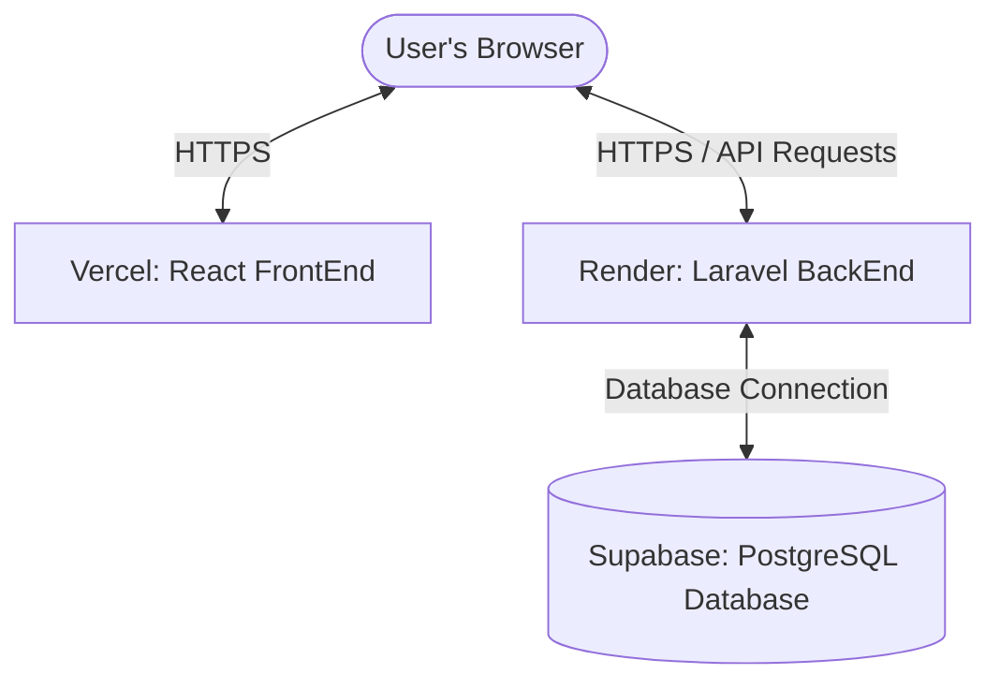

# Complete Production Deployment Guide

This guide details the step-by-step process of deploying your application live to the cloud.



---

## 📋 Table of Contents
1. [Overview & Architecture](#1-overview--architecture)
2. [Step 1: Database Provisioning (Supabase)](#step-1-database-provisioning-supabase)
3. [Step 2: Deploying the BackEnd API (Render)](#step-2-deploying-the-backend-api-render)
4. [Step 3: Preparing & Deploying the FrontEnd (Vercel)](#step-3-preparing--deploying-the-frontend-vercel)
5. [🔑 Environment Variables (.env) Reference Table](#-environment-variables-env-reference-table)
6. [🛠️ Troubleshooting & Post-Deployment Checklist](#%EF%B8%8F-troubleshooting--post-deployment-checklist)

---

## 1. Overview & Architecture

We will host your stack across three premium cloud platforms:
* **Supabase:** Hosts your PostgreSQL relational database (`numnum_db` migrate to cloud).
* **Render:** Hosts your PHP Laravel API server.
* **Vercel:** Hosts your React + Vite frontend, optimized for fast content delivery (CDN).

To make these components communicate securely, we'll configure them using environment variables and cross-origin resource sharing (CORS/Sanctum) settings.

---

## Step 1: Database Provisioning (Supabase)

Supabase offers a free, high-performance PostgreSQL instance that integrates perfectly with Laravel.

### 1. Create a Supabase Project
1. Go to [Supabase](https://supabase.com) and sign up / log in with your GitHub account.
2. Click **New Project** and select or create an organization.
3. Fill in the project details:
   - **Name:** `Num Num` (or similar)
   - **Database Password:** *Write this down somewhere safe!* (e.g., `YourSecurePassword`)
   - **Region:** Choose a region close to your user base or close to your Render service (e.g., `US East (N. Virginia)` if you deploy your backend on Render's US East).
   - **Pricing Plan:** Select the **Free** tier.
4. Click **Create new project** and wait a few minutes for the database to provision.

### 2. Retrieve Your PostgreSQL Credentials
Once provisioned, navigate to:
**Project Settings (gear icon in sidebar) ➔ Database**

Scroll down to the **Connection Info** section. You will need these credentials to configure Laravel:
* **Host:** `aws-0-us-east-1.pooler.supabase.com` (Example host)
* **Port:** `6543` (Transaction Pooler - *highly recommended for serverless/hosted platforms*) or `5432` (Direct connection).
* **Database Name:** `postgres`
* **Username:** `postgres.your-project-id`
* **Password:** The database password you set during creation.

---

## Step 2: Deploying the BackEnd API (Render)

Render can build and run your Laravel app natively or using a Docker container. Using a **Dockerfile** is the absolute most reliable method for Laravel on Render because it configures Nginx to point directly to Laravel's `/public` folder, preventing any configuration errors.

### 1. Add configuration files to your `BackEnd` folder

To deploy seamlessly, we will add a standard production configuration for Render.

#### A. Create a `Dockerfile` inside `BackEnd/`
Create a new file named `Dockerfile` in the root of your `BackEnd` directory:

```dockerfile
# Use official PHP-FPM with Alpine Linux for a lightweight footprint
FROM php:8.2-fpm-alpine

# Install system dependencies
RUN apk update && apk add --no-cache \
    nginx \
    supervisor \
    postgresql-dev \
    libpng-dev \
    libjpeg-turbo-dev \
    freetype-dev \
    zip \
    libzip-dev \
    unzip \
    git \
    bash

# Install PHP extensions
RUN docker-php-ext-configure gd --with-freetype --with-jpeg \
    && docker-php-ext-install pdo pdo_pgsql pgsql gd zip bcmath opcache

# Get Composer
COPY --from=composer:latest /usr/bin/composer /usr/bin/composer

# Set working directory
WORKDIR /var/www

# Copy codebase
COPY . /var/www

# Install production composer dependencies
RUN composer install --no-dev --no-interaction --prefer-dist --optimize-autoloader

# Setup storage and cache permissions
RUN chmod -R 775 storage bootstrap/cache \
    && chown -R www-data:www-data storage bootstrap/cache

# Copy Nginx config and Supervisor config
COPY docker/nginx.conf /etc/nginx/nginx.conf
COPY docker/supervisord.conf /etc/supervisord.conf

# Expose port
EXPOSE 80

# Start Supervisor to run both Nginx and PHP-FPM
CMD ["/usr/bin/supervisord", "-c", "/etc/supervisord.conf"]
```

#### B. Create Nginx Configuration `BackEnd/docker/nginx.conf`
Create a folder `docker` inside your `BackEnd/` directory, and place `nginx.conf` in it:

```nginx
user www-data;
worker_processes auto;
pid /run/nginx.pid;
include /etc/nginx/modules-enabled/*.conf;

events {
    worker_connections 768;
}

http {
    sendfile on;
    tcp_nopush on;
    tcp_nodelay on;
    keepalive_timeout 65;
    types_hash_max_size 2048;
    include /etc/nginx/mime.types;
    default_type application/octet-stream;

    access_log /var/log/nginx/access.log;
    error_log /var/log/nginx/error.log;

    gzip on;

    server {
        listen 80 default_server;
        listen [::]:80 default_server;

        root /var/www/public;
        index index.php index.html;

        server_name _;

        charset utf-8;

        location / {
            try_files $uri $uri/ /index.php?$query_string;
        }

        location = /favicon.ico { access_log off; log_not_found off; }
        location = /robots.txt  { access_log off; log_not_found off; }

        error_page 404 /index.php;

        location ~ \.php$ {
            fastcgi_pass 127.0.0.1:9000;
            fastcgi_param SCRIPT_FILENAME $realpath_root$fastcgi_script_name;
            include fastcgi_params;
        }

        location ~ /\.(?!well-known).* {
            deny all;
        }
    }
}
```

#### C. Create Supervisor Configuration `BackEnd/docker/supervisord.conf`
Place `supervisord.conf` in the `docker` folder as well. This manages background running of Nginx and PHP-FPM together:

```ini
[supervisord]
nodaemon=true
logfile=/var/log/supervisord.log
pidfile=/var/run/supervisord.pid

[program:php-fpm]
command=php-fpm
stdout_logfile=/dev/stdout
stdout_logfile_maxbytes=0
stderr_logfile=/dev/stderr
stderr_logfile_maxbytes=0
autorestart=true

[program:nginx]
command=nginx -g "daemon off;"
stdout_logfile=/dev/stdout
stdout_logfile_maxbytes=0
stderr_logfile=/dev/stderr
stderr_logfile_maxbytes=0
autorestart=true
```

> [!NOTE]
> If you prefer not to use Docker, you can create a standard Web Service on Render with environment `PHP`. 
> However, to redirect traffic to the `public/` directory, you must create a `.htaccess` file in the root of your `BackEnd/` directory:
> ```apache
> <IfModule mod_rewrite.c>
>     RewriteEngine on
>     RewriteCond %{REQUEST_URI} !^/public/
>     RewriteRule ^(.*)$ /public/$1 [L]
> </IfModule>
> ```
> *Note: Docker is highly recommended on Render as it is faster, has lower memory overhead, and runs exactly the same as in production.*

---

### 2. Deploy on Render
1. Go to [Render](https://render.com) and sign up / sign in.
2. Click **New +** ➔ **Web Service**.
3. Connect your GitHub repository.
4. Set the following parameters:
   - **Name:** `numnum-backend`
   - **Region:** Select a region (e.g., `Oregon (US West)` or `Ohio (US East)`). Make sure this matches your Supabase database region as closely as possible to reduce latency!
   - **Branch:** `main` (or your active git branch)
   - **Root Directory:** `BackEnd`
   - **Runtime:** `Docker` (Render automatically uses the `Dockerfile` inside the `BackEnd` folder)
   - **Instance Type:** Select the **Free** tier.
5. In the **Environment Variables** section, click **Add Environment Variable** and enter the environment values shown in the reference table below.
6. Click **Create Web Service**.

### 3. Run Database Migrations (Without Render Shell / Free Tier)

Since Render's interactive **Shell** is a paid tier feature, you can migrate your database tables to Supabase completely for free using one of the two methods below.

#### Method A: Temporary Local Migration (Recommended & Easiest)
Since your local PHP environment is already working, you can connect your local terminal directly to the live Supabase database to run the migrations.

1. Open your local `BackEnd/.env` file.
2. Temporarily replace your active database lines with your **Supabase credentials** (which you retrieved in Step 1):
   ```env
   # Temporary point to your live Supabase database:
   DB_CONNECTION=pgsql
   DB_HOST=aws-0-us-east-1.pooler.supabase.com  # Your Supabase host
   DB_PORT=6543
   DB_DATABASE=postgres
   DB_USERNAME=postgres.your-project-id        # Your Supabase username
   DB_PASSWORD=YourSecurePassword              # Your Supabase password
   ```
3. Open your local terminal inside the `BackEnd` directory and run:
   ```bash
   php artisan migrate
   ```
   *This connects from your PC over the internet directly to Supabase and builds all the tables!*
4. Restore your local `BackEnd/.env` back to using your local database:
   ```env
   DB_CONNECTION=pgsql
   DB_HOST=127.0.0.1
   DB_PORT=5432
   DB_DATABASE=numnum_db
   DB_USERNAME=postgres
   DB_PASSWORD=abuadmin
   ```

---

#### Method B: Create a Secure Cloud Trigger Route
If you want to trigger migrations directly on your live Render service without any local environment updates, you can register a temporary secure route.

1. Open `BackEnd/routes/web.php` and append the following route block at the end of the file:
   ```php
   use Illuminate\Support\Facades\Artisan;

   Route::get('/run-migrations/{secret}', function ($secret) {
       // Replace 'my-super-secret-key-123' with any password you like
       if ($secret !== 'my-super-secret-key-123') {
           abort(403, 'Unauthorized access.');
       }
       
       try {
           Artisan::call('migrate', ['--force' => true]);
           $output = Artisan::output();
           return "<pre>Migrations run successfully:\n" . e($output) . "</pre>";
       } catch (\Exception $e) {
           return "Error running migrations: " . e($e->getMessage());
       }
   });
   ```
2. Commit and push this change to your GitHub repository. Render will automatically redeploy.
3. Once the deployment finishes, open your browser and navigate to:
   `https://numnum-backend.onrender.com/run-migrations/my-super-secret-key-123`
4. The screen will display your migration details and a success status!
5. *(Optional but recommended)*: Once migration is complete, you can delete or comment out this route block and push again for security.

---

## Step 3: Preparing & Deploying the FrontEnd (Vercel)

Before pushing the frontend, you must make sure that its API endpoints are dynamic.

### 1. Update Frontend Code for Production
In [api.js](file:///j:/StartUp/Num%20Num/Coding/FrontEnd/src/services/api.js#L3-L10), the URL is currently hardcoded:
```javascript
const apiClient = axios.create({
  baseURL: 'http://localhost:8000/api',
  ...
});
```

We need to change this to read from Vite's environment variables so it can use the Render backend URL in production, while falling back to localhost during development:

```javascript
const apiClient = axios.create({
  baseURL: import.meta.env.VITE_API_BASE_URL || 'http://localhost:8000/api',
  headers: {
    'Content-Type': 'application/json',
    'Accept': 'application/json',
  },
});
```

### 2. Configure Vercel Routing (`vercel.json`)
Since your app is a single-page application (SPA) using `react-router-dom`, you need a configuration that routes all direct page refreshes back to `index.html` so you don't get **404 Page Not Found** errors.

Create a file named `vercel.json` in the root of your `FrontEnd/` directory:

```json
{
  "rewrites": [
    {
      "source": "/(.*)",
      "destination": "/index.html"
    }
  ]
}
```

### 3. Deploy on Vercel
1. Go to [Vercel](https://vercel.com) and log in using GitHub.
2. Click **Add New** ➔ **Project**.
3. Select your GitHub repository and click **Import**.
4. Configure the Project settings:
   - **Project Name:** `numnum-frontend`
   - **Framework Preset:** `Vite` (Vercel will auto-detect this)
   - **Root Directory:** Click `Edit` and choose `FrontEnd`.
   - **Build & Development Settings:** Leave as defaults.
5. In **Environment Variables**, add:
   - **Key:** `VITE_API_BASE_URL`
   - **Value:** `https://numnum-backend.onrender.com/api` (Replace this with the exact URL provided by Render on your backend dashboard).
6. Click **Deploy**.
7. Once deployed, you will get a production URL (e.g., `https://numnum-frontend.vercel.app`).

---

## 🔑 Environment Variables (.env) Reference Table

Use this list to configure your environments exactly as they are needed on both platforms.

### 1. BackEnd Env (Set these in **Render Dashboard ➔ Environment Variables**)

| Key | Suggested Value / Setting | Description |
| :--- | :--- | :--- |
| `APP_NAME` | `"Num Num"` | The name of your application. |
| `APP_ENV` | `production` | Switches Laravel into optimized, cached production mode. |
| `APP_DEBUG` | `false` | **CRITICAL:** Turns off error debugging trace screens for users. |
| `APP_KEY` | `base64:dVGqKhKt8bWSa+lg3+WzIXJ+0oxb5G0RJ31Z2joaKus=` | Keep your existing security key so logged-in tokens don't break. |
| `APP_URL` | `https://numnum-backend.onrender.com` | Your live backend URL from Render. |
| `DB_CONNECTION` | `pgsql` | Tells Laravel to connect using PostgreSQL. |
| `DB_HOST` | `aws-0-us-east-1.pooler.supabase.com` | The Database host from your **Supabase Settings**. |
| `DB_PORT` | `6543` | The database transaction pooler port. |
| `DB_DATABASE` | `postgres` | Default Database name in Supabase is `postgres`. |
| `DB_USERNAME` | `postgres.your-project-id` | Your Supabase database username. |
| `DB_PASSWORD` | `YourSecurePassword` | The database password you created in Supabase. |
| `SESSION_DRIVER` | `database` | Keeps user sessions inside your Supabase database. |
| `CACHE_STORE` | `database` | Caches database queries in your PostgreSQL DB. |
| `SANCTUM_STATEFUL_DOMAINS` | `numnum-frontend.vercel.app` | **CRITICAL:** The domain of your live frontend (WITHOUT `https://`). |
| `FRONTEND_URL` | `https://numnum-frontend.vercel.app` | **CRITICAL:** The full URL of your live frontend. |

### 2. FrontEnd Env (Set this in **Vercel Dashboard ➔ Environment Variables**)

| Key | Value | Description |
| :--- | :--- | :--- |
| `VITE_API_BASE_URL` | `https://numnum-backend.onrender.com/api` | The live API endpoint of your Render backend. |

---

## 🛠️ Troubleshooting & Post-Deployment Checklist

### 1. Solving CORS (Cross-Origin Resource Sharing) Errors
If you see console errors stating *Blocked by CORS policy*, this is because your Laravel backend has not whitelisted your frontend.
* **Fix:** Make sure that `SANCTUM_STATEFUL_DOMAINS` and `FRONTEND_URL` environment variables on Render are identical to your Vercel URL.
* In Laravel `config/cors.php`, verify that it accepts the frontend origins. If needed, make sure that `allowed_origins` includes your frontend URL.

### 2. Laravel Database Table Migrations
If you get a `500 Server Error` on API endpoints (like `/api/login` or `/api/restaurants`), it's usually because database tables have not been migrated yet.
* **Fix:** Use either **Method A** (Local Migration pointing to Supabase host temporarily) or **Method B** (Secure Trigger Route `/run-migrations/...`) described under **Step 2 (Section 3)** to construct the tables on the live database.

### 3. Vercel Route Page Refreshes (404 Error)
If refreshing a page (e.g. `numnum-frontend.vercel.app/login`) leads to a Vercel 404 page:
* **Fix:** Make sure you created the `vercel.json` file inside your `FrontEnd` directory (as explained in Step 3). This instructs Vercel to route all frontend paths to React.
